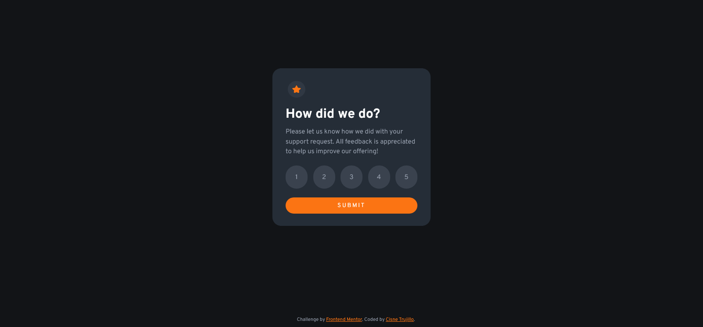

# Frontend Mentor - Interactive rating component solution

This is a solution to the [Interactive rating component challenge on Frontend Mentor](https://www.frontendmentor.io/challenges/interactive-rating-component-koxpeBUmI). Frontend Mentor challenges help you improve your coding skills by building realistic projects. 

## Table of contents

- [Overview](#overview)
  - [The challenge](#the-challenge)
  - [Screenshot](#screenshot)
  - [Links](#links)
- [My process](#my-process)
  - [Built with](#built-with)
  - [Continued development](#continued-development)
  - [Useful resources](#useful-resources)
- [Author](#author)

**Note: Delete this note and update the table of contents based on what sections you keep.**

## Overview

### The challenge

Users should be able to:

- View the optimal layout for the app depending on their device's screen size
- See hover states for all interactive elements on the page
- Select and submit a number rating
- See the "Thank you" card state after submitting a rating

### Screenshot

### Links

- Solution URL: [[Add solution URL here](https://github.com/cisneConCorbata/ratingComponent.git)](https://your-solution-url.com)
- Live Site URL: [(https://cisneconcorbata.github.io/ratingComponent)](https://cisneconcorbata.github.io/ratingComponent)

## My process

### Built with

- Flexbox

### Continued development

I'd like to learn more about how to make this solution more accessible, as the rating options can't be selected with tab at the moment.

### Useful resources

- [Stack Overflow 1](https://stackoverflow.com/questions/15839169/how-to-get-the-value-of-a-selected-radio-button) - This helped me understand how to use the value of a radio button to return it on a different section.
- [Stack Overflow 2](https://stackoverflow.com/questions/1431726/css-selector-for-a-checked-radio-buttons-label) - This helped me format the rating options without losing the functionality.

## Author

- GitHub - [cisneConCorbata](https://github.com/cisneConCorbata)
- Frontend Mentor - [@cisneConCorbata](https://www.frontendmentor.io/profile/cisneConCorbata)
